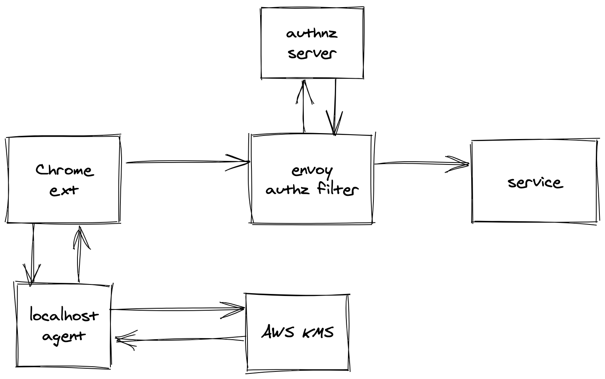

# zerotrust poc



Note: This is missing trust policies + trust engine

## Chrome Extension
The extension makes calls to the localhost agent and wraps HTTP calls to our selected domains.

## Agent
The agent is only responsible for calling AWS KMS to create an encrypted token.

## AWS KMS
KMS is used by both the client and server.

### Client
User clients are only allowed to encrypt with an EncryptionContext

```
"Condition": {
	"StringEquals": {
		"kms:EncryptionContext:username": "${aws:username}"
	},
	"Bool": {
		"aws:MultiFactorAuthPresent": "true"
        }
}
```

### Server
The server takes in the username and encrypted blob.  It uses the passed in username to match the encryption context.

## Envoy
Envoy acts as a front proxy.  We leverage the [Envoy authz filter](https://www.envoyproxy.io/docs/envoy/latest/configuration/http/http_filters/ext_authz_filter) to call an external HTTP endpoint for authn.

## Authn Server
Envoy calls this server for authn.
